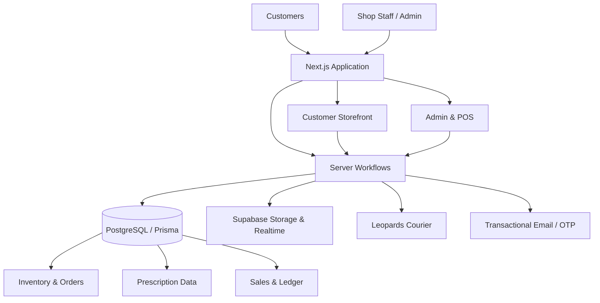

# Qayoom Optics — Engineering Case Study

**Production full-stack retail, e-commerce and optical-shop operations platform**

[Live production site](https://www.qayoomoptics.com) · [Architecture](docs/ARCHITECTURE.md) · [Engineering notes](docs/ENGINEERING.md) · [Screenshot guide](docs/SCREENSHOTS.md)

> This repository is a **sanitized public case study**. The production source code remains private because the application was built for a real business and contains commercial implementation details.

---

## Overview

Qayoom Optics is a production software platform built for an optical retail business in Pakistan. I designed and developed the application as the **sole full-stack developer**, covering both the customer-facing e-commerce experience and the internal workflows used by the physical shop.

The project goes beyond a conventional storefront. It combines online commerce, prescription-eyewear workflows, inventory, order fulfillment, courier integration, customer authentication, analytics and physical-shop POS operations in one system.

### My Role

**Sole Full-Stack Developer**

I was responsible for the project end-to-end:

- requirements and workflow analysis
- application architecture
- relational data modeling
- customer-facing frontend development
- backend/server workflows
- authentication and authorization
- third-party integrations
- admin and POS tooling
- debugging and production troubleshooting
- deployment and environment management

---

## The Business Problem

An optical retailer has requirements that do not fit neatly into a generic e-commerce template.

The business needed to support nationwide online product discovery and ordering, prescription-eyewear configuration, stock visibility, staff order processing, physical-shop sales, local courier booking, operational documents, customer accounts, reviews, inquiries and financial/shop-ledger workflows.

Instead of building disconnected tools for each workflow, the application centralizes them into one operational platform.

---

## System at a Glance

The application uses the Next.js App Router with server-rendered routes, server components, client components and server actions. PostgreSQL is modeled through Prisma, while Supabase provides database infrastructure, storage and realtime capabilities.

---

## Core Product Areas

### Customer Storefront

- product catalog and faceted discovery
- product detail pages
- prescription and lens configuration
- cart and checkout
- cash-on-delivery and bank-transfer workflows
- order tracking
- account and order history
- customer prescription records
- reviews and inquiries
- OTP-based authentication

### Administration

- realtime dashboard notifications
- order management
- product CRUD
- inventory and stock workflows
- prescription management
- analytics
- review moderation
- inquiry management
- operational reporting
- store configuration

### Physical Shop / POS

- POS terminal
- in-store sale recording
- sales history
- stock management
- financial ledger / Roznamcha workflows
- receipt reprinting
- 80mm thermal receipt output
- A4 packing slips

---

## Optical Prescription Domain

Prescription eyewear introduces domain-specific data that a generic store does not usually model.

The system supports optical values including **OD / OS, SPH, CYL, AXIS, ADD and PD**. Prescription data participates directly in the order workflow together with frame selection, lens configuration and pricing.

This required the commerce model to treat prescription information as structured product/order data rather than as an unrelated text note.

---

## Data Architecture

The production application uses **18+ Prisma models** across the retail domain.

| Domain | Representative data |
| --- | --- |
| Identity | Users, verification tokens |
| Catalog | Products, categories, product images |
| Inventory | Stock batches, stock state |
| Commerce | Orders, order items, payments, disputes |
| Optical | Prescriptions, customer prescription records |
| Customer operations | Reviews, inquiries |
| Physical shop | Sales and ledger / Roznamcha records |
| Configuration | Store and messaging configuration |

The order domain supports both online and physical-shop workflows so sales and inventory are not isolated into separate systems.

---

## Third-Party Integrations

### Leopards Courier

Domestic fulfillment includes integration with Leopards Courier for shipment booking, cancellation, courier-city resolution and shipping-label/slip retrieval.

Customer-entered city names do not always match the courier provider's city catalog, so the application uses multi-stage city matching rather than relying only on direct string equality.

### Email & Authentication

Transactional messaging covers order confirmation, internal order alerts, OTP authentication, shipping updates and delivery updates.

### Supabase

Supabase supports PostgreSQL infrastructure, realtime operational updates and file storage. Public product imagery and protected customer-uploaded documents are handled according to different access requirements.

---

## Authentication & Security

The application has separate administrative and customer authentication concerns.

Selected controls include:

- HMAC-SHA256 signed sessions
- protected administrative routes
- email OTP customer authentication
- OTP rate limiting
- timing-safe comparisons where appropriate
- authorization checks around customer resources
- protected private-document serving
- path-traversal protections in file-serving workflows
- environment-based secret management

The public case study intentionally excludes credentials, private customer data and sensitive commercial implementation details.

---

## Selected Engineering Problems

### Unified online commerce and physical-shop operations

Instead of maintaining separate data silos, the application uses a shared domain model so inventory, products and order activity can support both online and in-store workflows.

### Prescription products inside an e-commerce flow

Prescription configuration is modeled as structured commerce data, allowing the order lifecycle to preserve optical measurements, lens selections and pricing context.

### Courier city mismatch

Customer-entered city names can differ from the courier provider's city catalog. A staged matching strategy improves booking reliability without forcing customers to know the courier's internal naming conventions.

### Reprintable POS receipts

Historical receipts need to remain accurate even if product records or prices later change. The POS workflow preserves receipt snapshots so previously completed sales can be reproduced reliably.

### Multiple print formats

Operational documents include both **80mm thermal receipts** and **A4 packing slips**, requiring dedicated print-specific layout rules rather than standard browser-page styling.

### Protected third-party documents

Courier labels and private uploaded documents should not simply become public static URLs. The system uses protected serving/proxy workflows so access is mediated by application authorization.

---

## Technology

| Layer | Technology |
| --- | --- |
| Language | TypeScript 5 |
| Framework | Next.js 16 |
| UI | React 19 |
| Styling | Tailwind CSS v4 |
| Database | PostgreSQL |
| ORM | Prisma |
| Platform services | Supabase |
| Motion | Framer Motion |
| Charts | Recharts |
| Email | Nodemailer / SMTP workflows |
| Testing tooling | Playwright |
| Deployment | Vercel |

---

## Production Boundaries

This case study deliberately distinguishes production features from experiments and future possibilities.

- **Virtual / AR try-on is not part of the current production application.** Earlier prototype work explored that separately.
- **Online card/payment-gateway processing is not currently implemented.** Production checkout supports the business's COD and bank-transfer workflows.
- **Urdu/bilingual support is partial**, not an application-wide localization system.

These boundaries are included so the portfolio reflects the system as it actually exists.

---

## Source Code & Confidentiality

The production repository is private because this is commercial software used by a real business.

This public repository documents architecture, engineering decisions, domain complexity and system capabilities without publishing production source code, secrets, customer data, internal business records or sensitive operational details.

---

## Screenshots

A curated screenshot set will be added under `assets/screenshots/`.

Planned captures include the storefront, catalog/filtering, prescription configuration, checkout, tracking, admin dashboard, orders, product management, analytics, POS, sales history, thermal receipt and A4 packing slip.

See [`docs/SCREENSHOTS.md`](docs/SCREENSHOTS.md) for the capture checklist and redaction rules.

---

## What This Project Demonstrates

**Full-stack engineering · application architecture · relational data modeling · e-commerce · POS systems · inventory workflows · authentication · security-minded backend development · third-party API integrations · realtime operations · print workflows · debugging · deployment**

The most important part of the project is not the number of frameworks involved; it is that the software is designed around a real retailer's operational requirements and runs as a production system.
