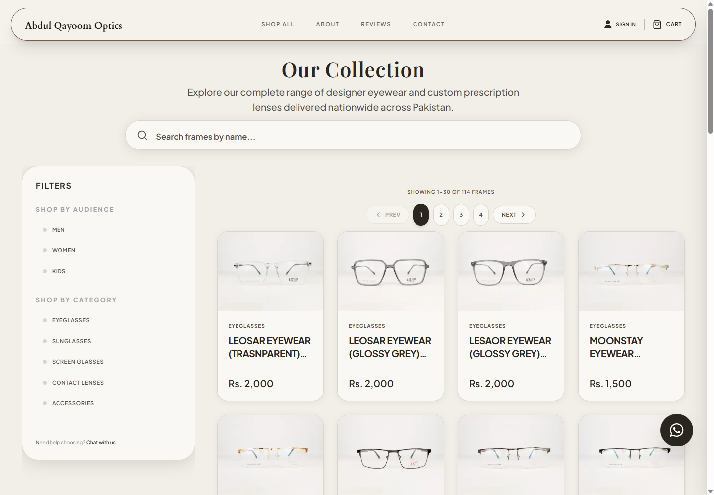
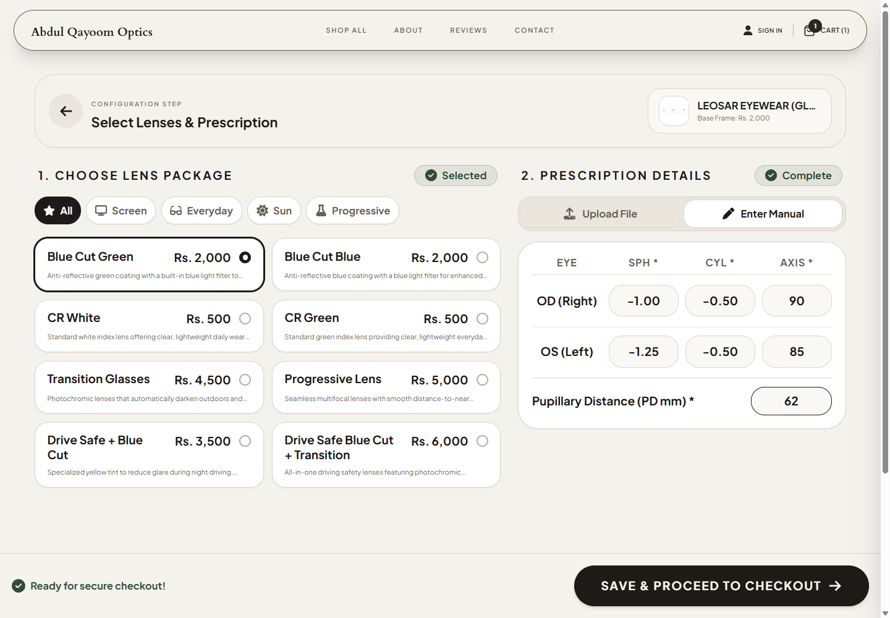
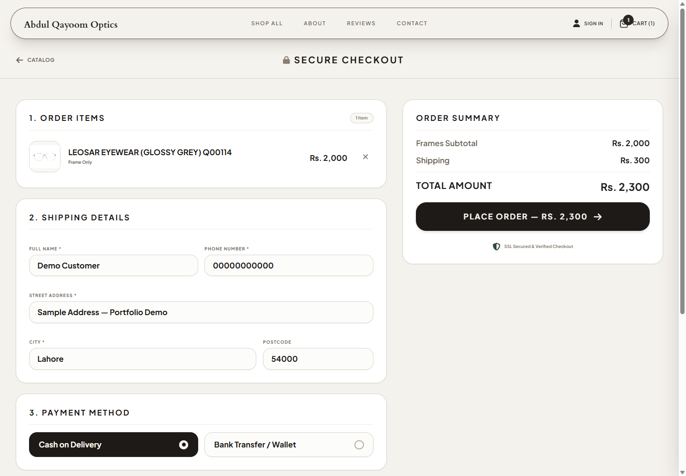
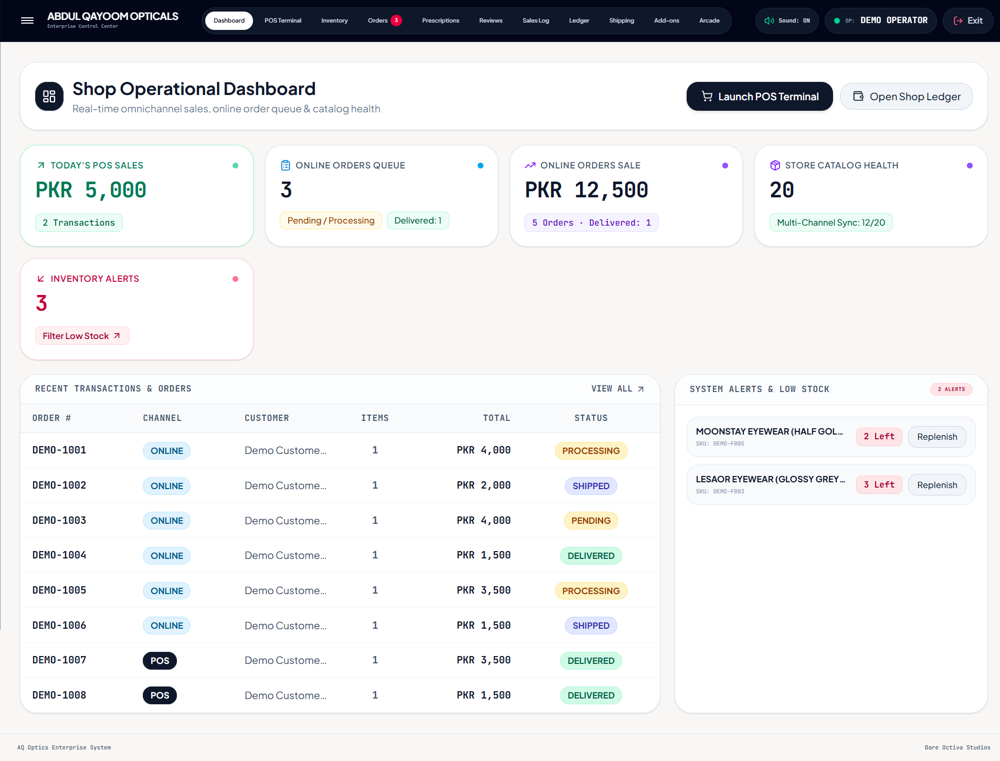
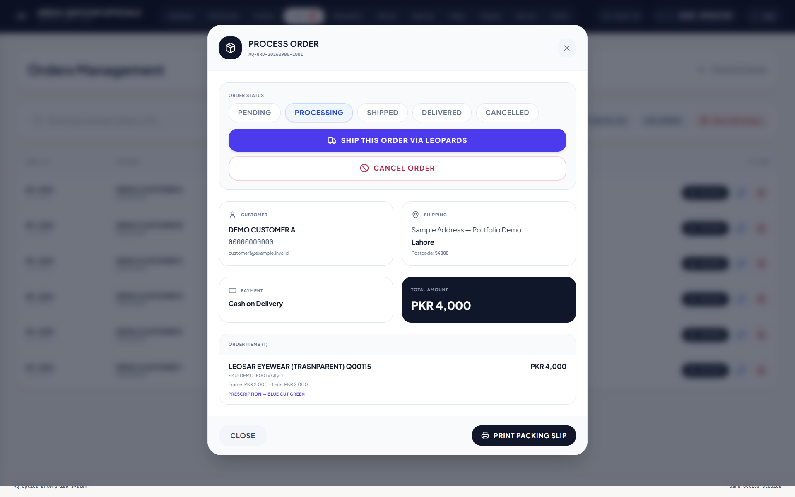
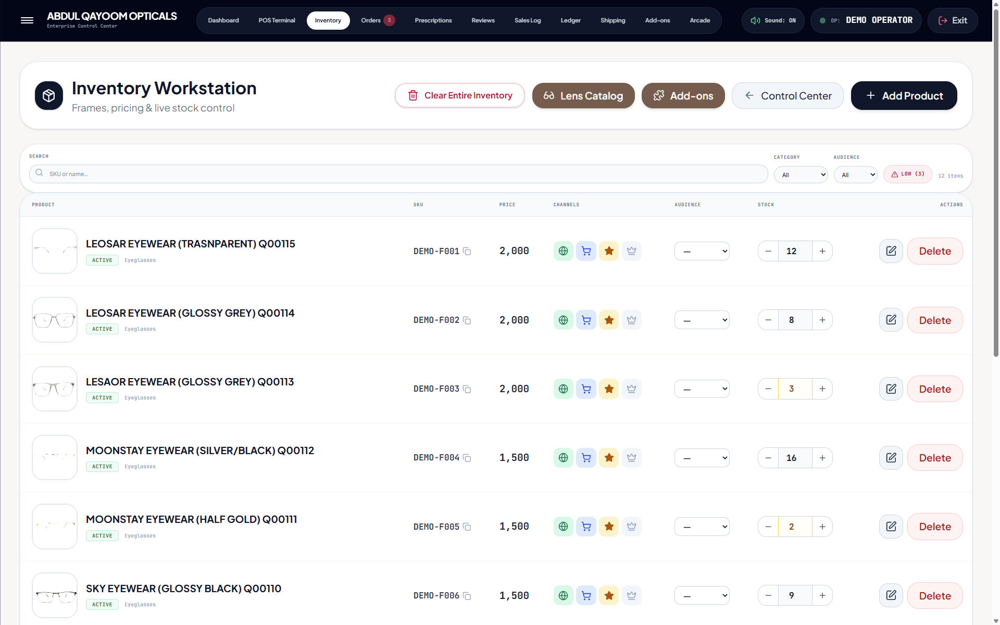
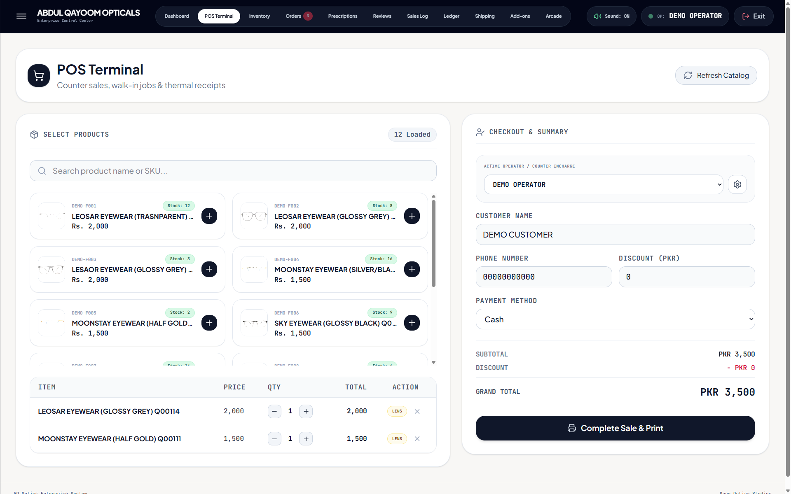
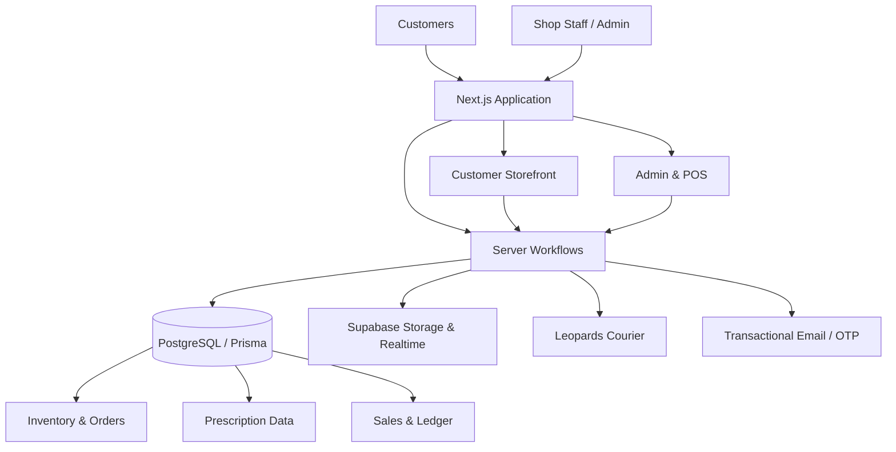

# Qayoom Optics — Engineering Case Study

**Production full-stack retail, e-commerce and optical-shop operations platform**

[Live production site](https://www.qayoomoptics.com) · [Architecture](docs/ARCHITECTURE.md) · [Engineering notes](docs/ENGINEERING.md)

> This repository is a **sanitized public case study**. The production source code remains private because the application was built for a real business and contains commercial implementation details.

---

## Product Overview

Qayoom Optics is a production software platform built for an optical retail business in Pakistan. I designed and developed the application as the **sole full-stack developer**, covering the customer-facing e-commerce experience, prescription-eyewear workflows, administration, inventory, fulfillment and physical-shop POS operations.

The system is not a storefront-only project. It combines online commerce and in-store operational software around one shared product, inventory and order domain.

### My Role

**Sole Full-Stack Developer**

I owned the project end-to-end across:

- requirements and workflow analysis
- application architecture
- relational data modeling
- customer-facing frontend development
- backend/server workflows
- authentication and authorization
- third-party integrations
- admin and POS tooling
- debugging and production troubleshooting
- deployment and environment management

---

## From Product Discovery to Prescription Commerce

The customer experience supports a real product catalog with audience/category filtering, search, pagination and pricing rather than a static marketing showcase.

Optical retail introduces requirements that generic commerce systems do not normally model. Prescription configuration is part of the purchase workflow itself, including OD/OS values and measurements such as SPH, CYL, AXIS and PD together with lens selection and pricing.

This required prescription information to be treated as structured commerce data rather than as a free-form note attached after checkout.

---

## Checkout & Order Workflow

The checkout flow combines order items, shipping details, totals and the business's supported payment methods.

Current production payment workflows are **Cash on Delivery** and **bank transfer / wallet**. Online card-gateway processing is not presented as a production feature.

---

## Operational Control Center

The internal application gives staff a consolidated view of online orders, physical-shop sales, catalog health and inventory alerts.

The goal was to avoid maintaining separate operational silos for the website and the physical shop. Products, stock and sales activity are coordinated through the same application domain.

---

## Fulfillment & Courier Operations

Order processing includes status management, customer/shipping context, prescription-aware line items and packing-slip generation.

Domestic fulfillment integrates with **Leopards Courier** for shipment workflows. Customer-entered city names do not always match the courier's canonical catalog, so city resolution uses a staged matching strategy rather than direct string equality alone.

Protected third-party document workflows are used where shipping labels or private documents should not simply become unrestricted public URLs.

---

## Inventory Management

The internal inventory workstation supports SKU search, pricing, stock adjustment, channel controls and low-stock visibility.

A central design decision was to keep online commerce and physical-shop inventory within the same operational model so staff are not forced to reconcile independent stock systems manually.

---

## Physical Shop POS

The same platform also supports walk-in sales through a dedicated POS terminal.

The POS workflow includes product selection, operator context, customer details, quantities, payment method and sale totals. Historical sale data is preserved so completed transactions can be reprinted reliably even if mutable product data changes later.

---

## Operational Documents

Retail software also needs to work outside the browser viewport. The system generates operational print output including A4 packing slips and 80mm thermal receipts.

  

The packing slip preserves line items, prescription values and order totals in a format designed for staff fulfillment rather than customer-facing browsing.

---

## System Architecture

The application uses the Next.js App Router with server-rendered routes, server components, client components and server actions. PostgreSQL is modeled through Prisma, while Supabase provides database infrastructure, storage and realtime capabilities.

See [`docs/ARCHITECTURE.md`](docs/ARCHITECTURE.md) for a more detailed walkthrough.

---

## Data Architecture

The production application uses **18+ Prisma models** across the retail domain.

| Domain | Representative data |
| --- | --- |
| Identity | Users, verification tokens |
| Catalog | Products, categories, product images |
| Inventory | Stock batches, stock state |
| Commerce | Orders, order items, payments, disputes |
| Optical | Prescriptions, customer prescription records |
| Customer operations | Reviews, inquiries |
| Physical shop | Sales and ledger / Roznamcha records |
| Configuration | Store and messaging configuration |

The order domain supports both online and physical-shop workflows so sales and inventory are not isolated into separate systems.

---

## Authentication & Security

The application has separate administrative and customer authentication concerns.

Selected controls include:

- HMAC-SHA256 signed sessions
- protected administrative routes
- email OTP customer authentication
- OTP rate limiting
- timing-safe comparisons where appropriate
- authorization checks around customer resources
- protected private-document serving
- path-traversal protections in file-serving workflows
- environment-based secret management

The public case study intentionally excludes credentials, private customer data and sensitive commercial implementation details.

---

## Selected Engineering Problems

### Unified online commerce and physical-shop operations

Instead of maintaining separate data silos, the application uses a shared domain model so inventory, products and order activity can support both online and in-store workflows.

### Prescription products inside an e-commerce flow

Prescription configuration is modeled as structured commerce data, allowing the order lifecycle to preserve optical measurements, lens selections and pricing context.

### Courier city mismatch

Customer-entered city names can differ from the courier provider's city catalog. A staged matching strategy improves booking reliability without forcing customers to know the courier's internal naming conventions.

### Reprintable POS receipts

Historical receipts need to remain accurate even if product records or prices later change. The POS workflow preserves receipt snapshots so previously completed sales can be reproduced reliably.

### Multiple print formats

Operational documents include both **80mm thermal receipts** and **A4 packing slips**, requiring dedicated print-specific layout rules rather than standard browser-page styling.

### Protected third-party documents

Courier labels and private uploaded documents should not simply become public static URLs. The system uses protected serving/proxy workflows so access is mediated by application authorization.

More detail is available in [`docs/ENGINEERING.md`](docs/ENGINEERING.md).

---

## Technology

| Layer | Technology |
| --- | --- |
| Language | TypeScript 5 |
| Framework | Next.js 16 |
| UI | React 19 |
| Styling | Tailwind CSS v4 |
| Database | PostgreSQL |
| ORM | Prisma |
| Platform services | Supabase |
| Motion | Framer Motion |
| Charts | Recharts |
| Email | Nodemailer / SMTP workflows |
| Testing tooling | Playwright |
| Deployment | Vercel |

---

## Production Boundaries

This case study deliberately distinguishes production features from experiments and future possibilities.

- **Virtual / AR try-on is not part of the current production application.** Earlier prototype work explored that separately.
- **Online card/payment-gateway processing is not currently implemented.** Production checkout supports the business's COD and bank-transfer workflows.
- **Urdu/bilingual support is partial**, not an application-wide localization system.

---

## Screenshot Disclosure

The screenshots in this repository show the existing application UI. **Customer, prescription, stock and operational data shown in portfolio captures are synthetic; public catalog imagery is used.** Synthetic dashboard revenue/order values are demonstration data and are not presented as real business results.

No production credentials, authentication data, real customer records, private prescriptions, bank receipts or sensitive ledger information are included in the published images.

---

## Source Code & Confidentiality

The production repository is private because this is commercial software used by a real business.

This public repository documents architecture, engineering decisions, domain complexity and system capabilities without publishing production source code, secrets, customer data, internal business records or sensitive operational details.

---

## What This Project Demonstrates

**Full-stack engineering · application architecture · relational data modeling · e-commerce · prescription commerce · POS systems · inventory workflows · authentication · security-minded backend development · third-party API integrations · realtime operations · print workflows · debugging · deployment**

The important part of this project is not the number of frameworks involved. It is that the software was designed around a real retailer's operational requirements and runs as a production system.
