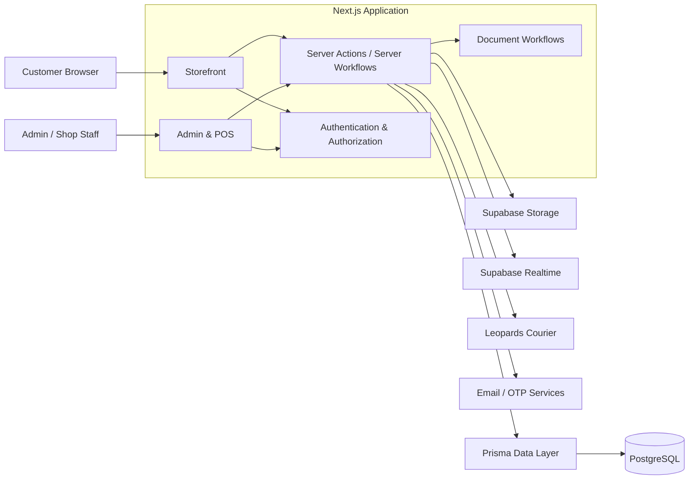
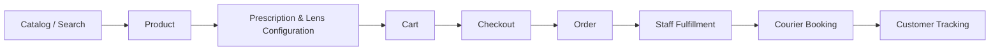
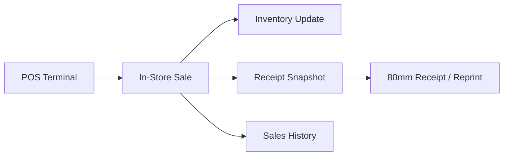

# System Architecture

This document describes the public, sanitized architecture of the Qayoom Optics production platform. It intentionally omits credentials, infrastructure identifiers and sensitive commercial implementation details.

## High-Level Architecture

## Application Layer

The system is built with Next.js App Router and uses a combination of server-rendered routes, server components, client components and server actions.

Customer-facing and staff-facing workflows live in the same application while remaining separated through routing, authentication and authorization boundaries.

## Data Layer

PostgreSQL is modeled through Prisma. The schema spans 18+ models across identity, catalog, inventory, commerce, prescriptions, customer operations, physical-shop records, financial ledger data and configuration.

A central design decision is to avoid creating completely separate online-store and physical-shop data silos. Shared product, stock and order concepts allow the application to coordinate both channels.

## Customer Commerce Flow

For non-prescription products, the prescription stage can be bypassed. Prescription eyewear preserves structured optical data as part of the commerce workflow.

## Physical-Shop Flow

Receipt snapshots preserve the historical sale representation used for later reprinting rather than depending entirely on mutable current product data.

## External Services

### Supabase

Used for PostgreSQL infrastructure plus application services such as realtime operational updates and storage.

### Leopards Courier

Integrated into domestic fulfillment workflows for shipment operations and shipping documents. City resolution includes staged matching to handle differences between customer-entered location names and the courier catalog.

### Email / OTP

Messaging workflows support customer authentication and transactional order events.

## Document Architecture

The application generates or serves multiple classes of operational documents:

- 80mm thermal receipts
- A4 packing slips
- courier labels/slips
- protected customer-uploaded documents

Print layouts have format-specific CSS. Private and third-party documents are not treated as unrestricted public assets.

## Security Boundaries

The production application separates customer and administrative authentication concerns and uses signed sessions, authorization checks, rate limiting and protected document access where applicable.

Secrets are supplied through the deployment environment rather than intentionally committed to source control.

## Deployment

The Next.js application is deployed through Vercel with external platform services and integrations configured through environment variables.

The production source repository remains private. This document is intentionally architectural rather than a deployment runbook.
